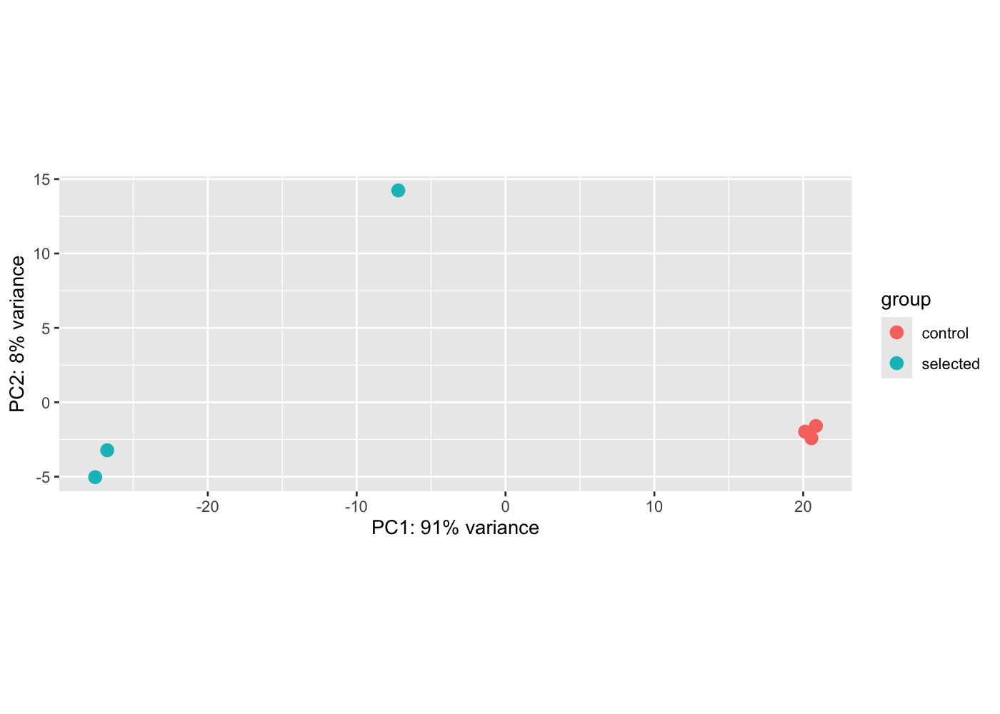
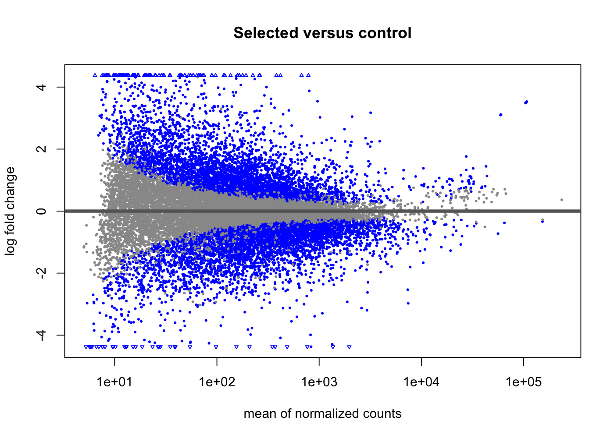

# PRJNA694496: selected-versus-control reanalysis

Generated 2026-09-25T18:09:49.510479+00:00.

Exploratory study-level results. QC and leave-one-out sensitivity have been reviewed; biological limitations still constrain interpretation and cross-study pooling.

## Design and methods

Three selected and three control whole-larva libraries; positive effects indicate higher constitutive expression in the selected population. Reference: GCF_963853765.1, RS_2024_06. Salmon 1.10.3 with decoys, sequence and GC bias correction; tximport gene-level summarization; DESeq2 ~ condition. Genes require at least 10 counts in at least three libraries. BH-adjusted p < 0.05 defines significance. Unshrunk effects and standard errors are retained; apeglm effects are for ranking only.

## Results

- Genes retained after count filtering: 19,816.
- Genes with nonmissing raw p-values: 19,814.
- Genes with nonmissing adjusted p-values: 19,814.
- Significant genes: 8,802; 4,353 higher and 4,449 lower in selected larvae.
- Mapping rates: 42.13%–63.94%.
- PC1 explains 90.6% of variance and separates all selected libraries from all controls.
- Control correlations are 0.996–0.996; selected B/C correlation is 0.991.
- Selected A is displaced on PC2 and has 6 genes above the Cook's-distance threshold; it is retained in the primary model.

## Selected A sensitivity analysis

A leave-one-out model excludes selected A while retaining the same filtered gene set, leaving two selected and three control libraries. This is a sensitivity analysis; the six-library model remains primary.

- Effect correlation with the primary model: 0.962.
- Primary significant genes retaining the same direction: 8,802 of 8,802.
- Primary significant genes remaining significant at FDR < 0.05: 8,639.
- Significant genes in the sensitivity model: 11,994.

## Functional annotation and evidence release

All 19,816 tested genes have exact GeneID mappings and versioned descriptions/biotypes from GCF_963853765.1 / RS_2024_06. RefSeq-characterized descriptions are available for 2,703 selected-higher genes and 3,271 selected-lower genes.

Local gene-biotype over-representation found selected-higher enrichment for lncRNA (1.28-fold; BH-adjusted p=2.89e-07) and rRNA (4.55-fold; adjusted p=7.88e-10), and selected-lower enrichment for protein-coding genes (1.03-fold; adjusted p=2.65e-20). These broad classes do not substitute for formal GO/pathway analysis.

The production harmonized evidence release contains every tested effect and standard error, with exact current-reference mapping.

Formal version-matched g:Profiler analysis mapped all direction-specific RefSeq symbols without failure or ambiguity. Selected-higher genes produced 35 significant GO terms led by RNA binding, RNA processing, and ribonucleoprotein-complex annotations. Selected-lower genes produced 108 terms led by catalytic activity, small-molecule metabolism, cytoskeleton, and phosphorus/phosphate metabolism. The oyster build supplied GO only; KEGG, Reactome, and WikiPathways results were unavailable.

## Descriptive comparison with the earlier heat-response study

Of 60 mapped, published significant heat-response genes in PRJNA516762, 52 occur among the genes retained here; 33 are significant here. The overlap table retains both effect directions and the earlier study's inferred mapping confidence.

No pooled effect or enrichment test is calculated. PRJNA516762 provides a significant-only gene list without standard errors, and its acute heat response in juvenile gill differs from constitutive expression in selected larvae. Direction agreement is descriptive and does not establish a common protective mechanism.

## Interpretation limits

Selection is confounded with population background. Survival was assessed in related later-stage cohorts, not the sequenced larval pools. These results are associations, not validated predictors of individual survival. Mapping-rate variation, sample correlation/PCA, and Cook's distances require joint review; no samples were removed automatically. Missing p-values and adjusted p-values remain missing.

## Files

- `gene_results_annotated.tsv`: all retained genes, effects, uncertainty, transcript provenance, and ranking-only shrunken effects.
- `top_25_genes.tsv`: significant genes ordered by absolute shrunken effect.
- `cross_study_descriptive_overlap.tsv`: mapped overlap, without statistical pooling.
- `exclude_selected_A_summary.tsv` and `exclude_selected_A_comparison.tsv`: leave-one-out robustness results.
- `refseq_annotation_report.md`, `refseq_biotype_summary.tsv`, and `refseq_biotype_enrichment.tsv`: local versioned functional annotations.
- `enrichment/functional_enrichment.tsv`, `functional_enrichment_report.md`, and `enrichment_qc.json`: direction-specific g:Profiler GO results and conversion QC.
- QC tables, figures, software session information, and input SHA-256 checksums are alongside this report.
